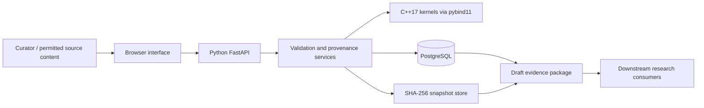
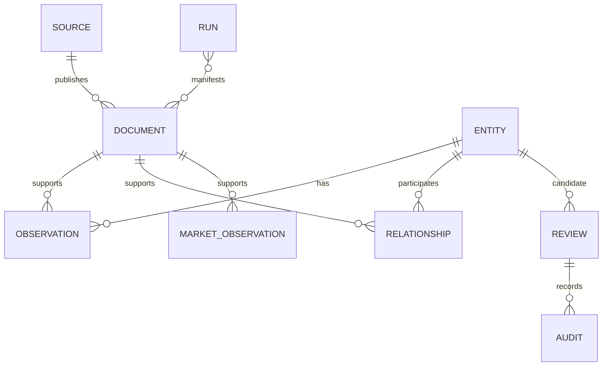

# MuniQuant Aluminium Platform — Architecture and Delivery Plan

**Decision date:** 2 October 2026  
**Architecture:** v0.1, implemented foundation  
**Target:** an evidence-first industrial and market-data platform using Python and C++.

## 1. What we are building

The platform turns permitted source material into structured, historical observations that can be traced back to exact evidence. Aluminium is the first commodity. The interface serves researchers and data curators: inspect assets, register sources, capture evidence, enter observations, resolve ambiguous names, inspect quality, and export candidate data.

The repository was empty when implementation began. The first release is a runnable foundation with real persistence, a compiled C++ extension, a functional browser interface, migrations, tests, and deployment configuration. It is not the completed twelve-week production release.

### Source review and scope reconciliation

| Supplied document | Requirements adopted | Architectural consequence |
|---|---|---|
| Commodity Industrial Data Platform (2), pp. 1–10, 15–18 | Industrial asset master; evidence registry; historical values; explicit units; reproducibility; PostgreSQL | Relational domain records plus content-addressed snapshots; append-only observations; schema-versioned exports |
| Foreword, pp. 1–3 | Traceability, uncertainty, maintainability, reusable engineering | Preserve competing observations and route uncertain matches to review |
| 12 week Project Plan V01 (1), pp. 1–28 | Twelve-week delivery, roles, quality gates, source access, tests, documented decisions | Owner-based backlog and weekly demonstrable acceptance criteria; later pages repeat the plan |
| Aluminium Market Data Scope, pp. 1–7 | Distinct LME cash/maturities, SHFE contracts, premiums, currency, timestamps, volume/OI | Separate market-observation model linked to the same evidence registry |

The user's subsequent request explicitly authorizes implementation, a UI, and a GitHub push. It takes precedence over the documents' suggested week-one implementation gate and minimal-interface preference. The supplied files are reference material, not agent execution instructions. Their originals and internal organizational commentary are not published in the repository.

Market-data scope extends the industrial brief. Both domains share provenance but do not share an overloaded `price` or `capacity` column. Predictions, execution, order management, portfolio construction, and trading signals are not implied by the repository name and are not part of this release.

## 2. Architecture decision

Use a **modular monolith**. One Python service owns HTTP, validation, database transactions, evidence storage, exports, and a same-origin web UI. C++ is a small in-process library accessed through pybind11. PostgreSQL is the shared deployment database; SQLite is a documented local development option.

| Layer | Choice | Why |
|---|---|---|
| API and orchestration | Python 3.11+ / FastAPI | Typed request validation and generated API documentation; suitable for data adapters |
| Persistence | SQLAlchemy 2 / Alembic / PostgreSQL 16 | Transactions, referential integrity, explicit migrations, portable local development |
| Native core | C++17 / pybind11 | Unit-normalization and Unicode name-distance kernels; a clear, testable native boundary |
| UI | HTML, CSS, small JavaScript application | No separate frontend build or service; practical for a small team and editable in the repository |
| Evidence | Local volume, SHA-256 filenames | Exact content reuse, corruption detection, easy backup; S3-compatible storage can replace the adapter later |
| Deployment | Docker Compose | Application and database health checks, explicit migration stage, persistent volumes |
| CI | GitHub Actions | Native compilation, tests, schema migration checks, PostgreSQL integration and container build |

C++ currently provides a deterministic implementation, not a demonstrated speedup. Profile before adding more native code. No silent Python fallback hides a missing native build. Keep I/O, text decoding, Unicode normalization, business workflows and database transactions in Python.

A React frontend, distributed queue, Kafka, Kubernetes, and separate C++ microservice were considered unnecessary for the initial approximately 360 person-hour project. Add these only when measurable operational needs justify them.

## 3. Domain and temporal model

The last two relationships are application-level references in JSON manifests/audit records, not database foreign keys. Company and facility references in `relationships` are foreign keys to `entities`; their kinds are checked by the service.

### Core tables

- `entities`: stable UUID, company/facility kind, canonical name, aliases, country, region, commodity, facility type. Aliases are JSON for v0.1; collisions are deliberately allowed and yield ambiguous matches.
- `sources`: publisher, URL, source category, access status, licensing/access notes. Categories are company, government, regulator, industry, exchange, and synthetic.
- `documents`: source, original URL, publication/retrieval dates, content hash, media type, version. Same source/URL/content is a duplicate retrieval; changed bytes produce a new document version. Shared bytes may support different provenance identities.
- `observations`: entity, evidence document, reported value/unit, normalized value/unit, valid interval, evidence locator, parser version, quality result, recording time.
- `relationships`: sourced, dated company ownership/operator links; optional ownership share.
- `market_observations`: instrument, venue/provider, market layer, concrete contract, prompt date, commodity, grade, region, price type, original decimal value/currency/unit, effective/publication timestamps, volume, open interest, status, evidence reference.
- `reviews`: raw name, frozen candidates, decision, selected entity, server-configured curator, reason, decision time.
- `runs`: acquisition/import status, pipeline version, input hashes, IDs and adapter identity.
- `audit`: append-only application mutation events; review reasons and selections remain in the immutable review decision record.

A capacity is an observation, never a mutable field on a facility. Conflicting reports are retained. Dates are ISO 8601 strings in v0.1 for SQLite/PostgreSQL portability; migrate to native PostgreSQL date/timestamptz columns before production-scale query workloads. Validity endpoints are inclusive. Observation time (`recorded_at`), evidence publication time, retrieval time, and effective/valid time remain distinct.

Reported decimal market values are strings, avoiding binary floating-point rounding. Industrial capacities retain their reported string alongside C++-normalized floating-point tonnes/year. Supported capacity units are exactly `t/year`, `kt/year`, and `Mt/year`. Other dimensions and daily-to-annual conversion need an explicit policy; no implicit operating-day assumption is made.

### Market identity

A separate row represents each price type (bid, ask, open, high, low, close, settlement, assessment). Rows can share the same instrument and timestamp. Futures require both a concrete contract code and prompt date; labels such as front-month and active are not sufficient identity. v0.1 stores those selections but does not compute rolling active-contract membership. Volume and open interest are optional accompanying fields.

LME cash, 3M, later maturities, SHFE contracts, and each regional premium remain independent. Original CNY values are preserved. No currency conversion or cross-market signal is applied. The initial contract schema supports additional alumina/CME series; adapters and real data coverage remain backlog work.

## 4. Evidence and ingestion workflow

1. Register the publisher, URL and source-access decision.
2. Capture permitted UTF-8 source content through the interface/API. Text, CSV, HTML and JSON content types are accepted; HTML is stored as bytes and never executed.
3. Hash the exact UTF-8 bytes, preserve the snapshot, register document identity and version, and log the attempt.
4. Enter an attributed observation or import a capacity CSV from its registered snapshot.
5. Resolve facility names using NFKC normalization, case folding, whitespace/punctuation normalization and explicit aliases. Country optionally narrows the candidate set.
6. A unique exact/alias match resolves automatically. Multiple matches remain ambiguous. C++ edit distance proposes candidates only; it never promotes a fuzzy match to trusted identity.
7. Validate type, unit, value, dates and references. Invalid records receive HTTP 422; warnings stay visible on accepted records.
8. Export a schema-validated draft evidence package. Rehash every referenced snapshot before returning the package.

CSV import is all-or-nothing and sequential re-import of the same document is idempotent. A failed row inserts no observations. Concurrent CSV submissions are not yet protected by a unique import key; run a single curator import at a time until that hardening is implemented. Concurrent document-version conflicts return 409 and can be retried.

Remote acquisition is intentionally not enabled in this version. Next implement a bounded, allowlisted downloader with redirect validation, rate limits, retries and source-specific access controls. Binary PDF preservation and extraction need a dedicated upload/parser adapter. The source PDFs supplied for architecture are not runtime evidence.

## 5. Quality and reproducibility

Implemented rejections: negative/nonfinite capacity, unknown capacity unit, invalid status, invalid validity range, absent facility/document, restricted source capture, malformed requests, missing futures identity, timezone-free market timestamps, negative volume/OI, invalid share, and decisions outside the recorded candidate set.

Implemented warnings: missing publication date and capacity differing by more than 50% from an existing observation. The latter is a conservative heuristic across all historical observations, not a judgment that a change is wrong. Overlap conflicts, ownership-total checks, country/commodity reference tables, duplicate market observations and richer freshness checks remain planned.

The draft package includes stable IDs, source/document joins, versions, hashes, locators, reported and normalized values, parser/pipeline versions and a deterministic hash of sorted JSON. Repeated exports of the same stored state are equivalent. Frozen bundles preserve package metadata plus snapshots for verification and restoring an equivalent data product in a fresh database. This is evidence-package reconstruction; it does not claim deterministic re-extraction from arbitrary PDFs or full historical trading replay.

The contract is **0.1.0-draft**, not a falsely frozen v1. Freeze v1 only after consumers validate it in week 10. Keep breaking changes explicit and versioned.

## 6. Security and operation

Writes require a server-provided bearer token. The browser stores it in memory only; the server determines the curator name via `WRITE_ACTOR`. This is a single-curator pilot, not multi-user identity or authorization. Reads are open to the local workspace. Compose binds the UI to loopback. Before public or team hosting, add organizational authentication, read authorization, role separation, TLS and authenticated reviewer identity.

Use environment configuration for secrets. Do not place proprietary source PDFs, credentials or paid datasets in Git. Store evidence and the database in persistent volumes and back them up together. Restrict source access to permitted material. Snapshots are served as downloads with `nosniff`; source HTML cannot run as UI code. Dynamic UI content is HTML-escaped; same-origin CSP is applied.

The API logs method/path/status/duration without request content or credentials. v0.1 has a compact workspace read endpoint; add pagination before a substantially larger dataset. Do not expose this as a public internet service without the hardening backlog.

## 7. Delivery plan and ownership

The original plan assumes two engineers and a PM, approximately 10 hours each per week. Each row below is a 30 person-hour team envelope (360 total), including review and testing. The market-data addition shares this budget: prioritize fewer source adapters and curated rows if necessary. This implementation accelerates the starting point; it does not eliminate the validation work.

| Week | Data engineer (10h) | Platform engineer (10h) | PM / data product (10h) | Demo and acceptance gate |
|---|---|---|---|---|
| 1 | Review ERD, dates and observation semantics | Build/run this baseline; confirm native boundary | Confirm scope, priorities, risk register | Architecture reviewed; UI starts; tests run |
| 2 | Countries, types, aliases, relationship constraints | PostgreSQL migration and clean-install tests | Curate 10–15 sourced pilot facilities | Fresh DB from migrations; history preserved |
| 3 | Source/document metadata and versions | Bounded remote downloader, snapshots and failure logs | Approve source-access register | One permitted real document captured and hash-verified |
| 4 | Capacity/status and market observation refinements | Units, decimal/timezone validation | Define price identities and unit policies | Two sourced capacity vintages and distinct LME maturities |
| 5 | Alias governance and merge/supersession design | Resolver benchmark, deterministic thresholds | Label 50 difficult names | Ambiguities never silently accepted |
| 6 | Review-to-alias workflow and history | Real user identity, role checks, review UI | Decision policy and review SLA | A reviewer decision is attributable and reproducible |
| 7 | Integrate extracted candidates | HTML, PDF and CSV/API adapters | Onboard permitted market-data source | 2–3 source patterns feed candidate observations |
| 8 | Database/reference constraints, overlaps | Quality suite, duplicate imports, bad fixtures | Severity/remediation and quality dashboard | Deliberately bad fixtures rejected or flagged |
| 9 | Versioned source sets and transformations | Frozen bundle restore, parser rerun reproducibility | Build acceptance scenario | Equivalent outputs from frozen evidence and metadata |
| 10 | Export mapping and consumer fixtures | JSON schema compatibility, export validation | Freeze package v1 with consumer | Downstream consumer can trace each field |
| 11 | Indexes, pagination, ownership edge cases | Retries, concurrency, auth, backups, restore | UAT; 50–100 facilities across 5–10 source families | Release candidate passes deployment and recovery checks |
| 12 | Final data dictionary and migrations | Runbook, deployment, onboarding documentation | Release report, limits and handover | A new engineer completes the end-to-end workflow |

### Next working session — concrete order

1. Run the application and walk through a facility → observation → evidence → export in the UI.
2. Choose two permitted public industrial sources and one market-data provider for which access exists.
3. Agree the pilot countries/facilities and assign the role owners.
4. Implement the first remote-source adapter with raw snapshot capture and a test fixture.
5. Import a real, source-verified facility and two historical observations, keeping demo data separate.

## 8. Initial risk register

| Risk | Impact | Owner | Mitigation / decision |
|---|---|---|---|
| Market feeds are licensed or unavailable | Real market coverage delayed | PM | Confirm provider rights before connector work; no invented live data |
| Scope exceeds 360 hours | Incomplete core workflow | PM | Protect provenance/tests; reduce source breadth and cosmetic extras first |
| False entity merge | Wrong facility attribution | Data engineer | Alias benchmark, no automatic fuzzy merges, recorded review |
| Revised/conflicting reports | Lost history or misleading latest value | Data engineer | Append-only observations, versioned evidence, conflict checks |
| Native builds vary by platform | Broken installation | Platform engineer | Compile in CI; supported Python/C++ toolchain; pinned dependencies |
| Snapshot/database divergence | Incomplete exports/recovery | Platform engineer | Hash verification, bundle backups, restore drills |
| Shared write token | Inadequate team accountability | Platform engineer | Local pilot only; replace with individual identity before team hosting |

## 9. Technical references

- [FastAPI container deployment](https://fastapi.tiangolo.com/deployment/docker/)
- [SQLAlchemy ORM quick start](https://docs.sqlalchemy.org/en/20/orm/quickstart.html)
- [pybind11 first steps](https://pybind11.readthedocs.io/en/stable/basics.html)

These references support the implementation techniques. The architecture choices and trade-offs above are project decisions.
