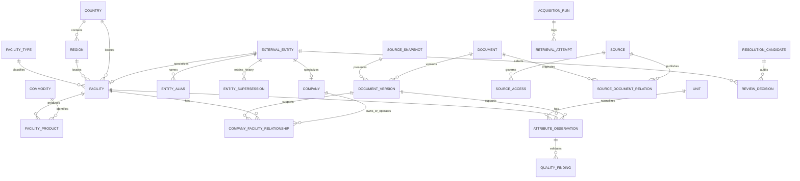

# ERD_v0.1 — proposed, Gate 1 pending

All relationships above are proposed foreign keys; run manifests also preserve parser version and input hashes. Capacity and status are constrained specializations of attributed observations. Supersession does not delete historical IDs. Preserve baseline IDs through additive migrations; no production tables are created in this Gate 1 proposal.
