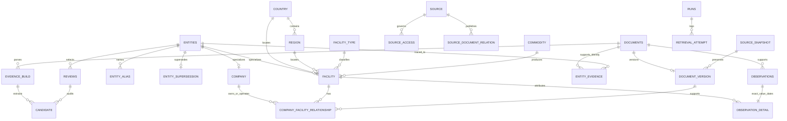

# Implemented domain relationships

Gate 1 approved 2026-10-10; additive migrations preserve legacy external entity IDs. app/models.py and the migration chain are the precise schema source.

Capacity/status are database views over attributed observations. Facility alias is a view over entity_alias. Known unit/attribute dimensions are database CHECK constraints; native normalized dates and exact decimals reside in observation_detail. Quality findings are recomputed from persisted evidence rather than treated as stale stored truth. Reviews hold one immutable final decision and audits hold candidate additions, aliases and mutations. Source/document versions intentionally retain the legacy document ID per version; source plus URL plus version is unique.
